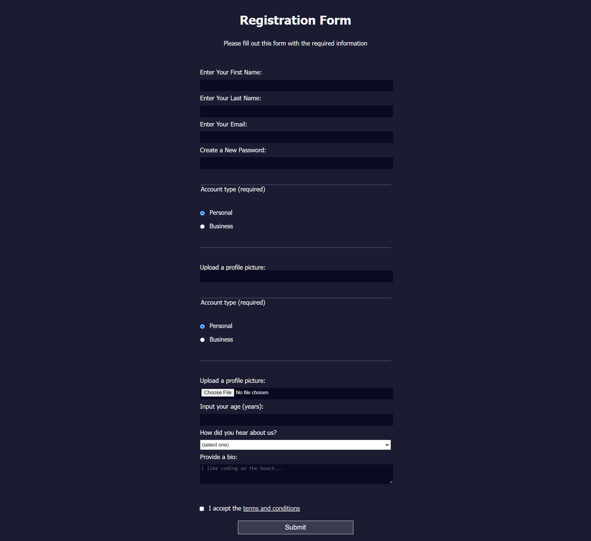

# FreeCodeCamp - Responsive Web Design Certification - Registration Form
Project #003

Follow this link for assigment
[Registration Form by Free Code Camp](https://www.freecodecamp.org/learn/2022/responsive-web-design/#learn-html-forms-by-building-a-registration-form)

### My notes
Nothing fancy, html, form and css basics  
4th Exercise that is project like @FreeCodeCamp 

